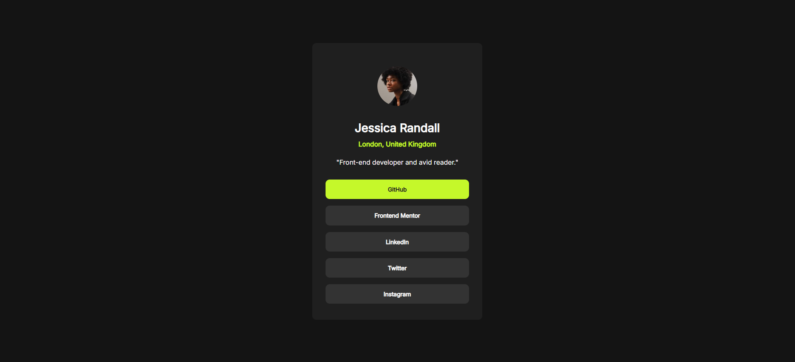

# Frontend Mentor - Social links profile solution

This is a solution to the [Social links profile challenge on Frontend Mentor](https://www.frontendmentor.io/challenges/social-links-profile-UG32l9m6dQ). Frontend Mentor challenges help you improve your coding skills by building realistic projects. 

## Table of contents

- [Overview](#overview)
  - [The challenge](#the-challenge)
  - [Screenshot](#screenshot)
  - [Links](#links)
- [My process](#my-process)
  - [Built with](#built-with)
  - [What I learned](#what-i-learned)
  - [Continued development](#continued-development)
  - [Useful resources](#useful-resources)
- [Author](#author)
- [Acknowledgments](#acknowledgments)

## Overview

### The challenge

Users should be able to:

- See hover and focus states for all interactive elements on the page

### Screenshot



### Links
- Live Site URL: [URL](https://krsng-lab.github.io/social-links-profile-main/)

## My process

### Built with

- Semantic HTML5 markup
- CSS custom properties
- Flexbox
- CSS Grid
- Mobile-first workflow

### What I learned

```css
@import url('https://fonts.googleapis.com/css2?family=Inter&display=swap');
```
```css
.nav-box:hover {
    background-color: hsl(75, 94%, 57%);
    color: hsl(0, 0%, 12%);;
}
```
```css
img {
    border-radius: 50%;
}
```

### Continued development

This project has shown me that I have yet to become comfortable enough with working with flexbox. I spent a lot of time trying to figure out how to format things in a certain way (e.g. pushing the attribution/footer to the bottom of the page). However I believe with further practice I should be able to pick up on some common techniques so that it can become second nature to me. 

### Useful resources

- [W3School](https://www.w3schools.com/) - I found this website extremely helpful in explaining basic HTML and CSS concepts. Basically my handbook at my current level. 
- [FLEX Cheatsheet](https://flexbox.malven.co/) - Very convenient way to reference flex properties. 

## Author

- Website - [kr-sng](https://krsng-lab.github.io/)
- Frontend Mentor - [@krsng-lab](https://www.frontendmentor.io/profile/krsng-lab)

## Acknowledgments

Special credits to The Odin Project for giving me the foundations to tackle this project more easily, as well as [P1xt Guides](https://github.com/P1xt/p1xt-guides) which provided this project as part of its curriculum. 

